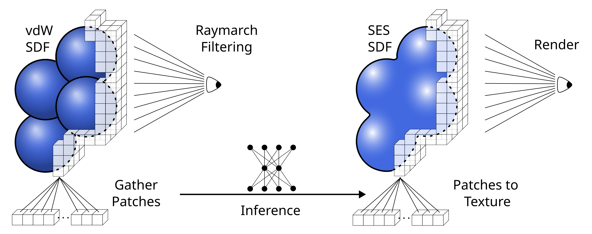
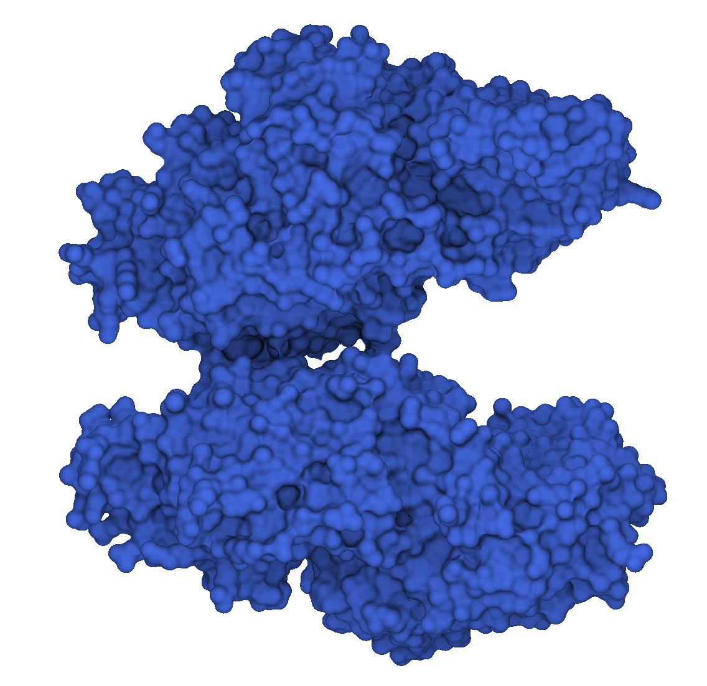

# DeepSES

[](https://www.python.org/)
[](https://pytorch.org/)
[](https://isocpp.org/)
[](https://www.opengl.org/)
[](https://developer.nvidia.com/cuda-zone)
[](https://developer.nvidia.com/tensorrt)

This repository contains the code accompanying the paper **DeepSES: Learning solvent-excluded surfaces via neural signed distance fields** [View Paper](https://doi.org/10.1016/j.cag.2025.104392).   
It can be used to train a neural network for predicting the signed distance field (SDF) of the solvent-excluded surface (SES) of a molecule from the SDF of the van-der-Waals (vdW) surface and render the SES at interactive frame rates.



---

## Table of Contents

- [Overview](#overview)  
- [Paper](#paper)  
- [Training](#training)  
  - [Environment Setup](#environment-setup)  
  - [Data](#data)  
  - [Training Instructions](#training-instructions)  
- [Execution](#execution)  
  - [Singularity Container](#singularity-container)  
  - [Building and Running](#building-and-running)   
- [Citing this work](#citing-this-work)  
- [License](#license)  

---

## Overview

This project implements reparametrized noise (amplitude / frequency modulation) for SDFs for the SES as described in our paper, and is based on ... . 

1. **Training code** in Python: We use Pytorch to train a 3D convolutional neural network (CNN) to predict the SDF of the SES from the SDF of the vdW surface for molecules of different sizes.     
The model works on patches of size 64³ from the whole SDF for which we set a default resolution of 512³, but it can also be used for larger resolutions.    
Each 64³ patch is randomly sampled from a set of molecules and from the whole 512³ SDF. Additionally, we apply a random augmentation to each patch (mirroring or flipping axes).    
The training data can be found [here](https://doi.org/10.5281/zenodo.17086718).

2. **Execution code** in C++: We use OpenGL, CUDA and TensorRT to compute and render the SDF of the SES.    
The trained Pytorch model is saved as an .onnx file and used to create TensorRT engine for inference, which is optimized for the used hardware.     
The pipeline works roughly as follows:  
    - A compute shader in OpenGL computes the vdW SDF (3D texture). 
    - The SES SDF is computed via the TensorRT engine.
    - A ray marching shader is used to render the SDF while adding simplex noise.
    - (optionally ambient occlusion is computed)
In this demo we compute the vdW and SES SDF only once at the beginning but it can also be recomputed each frame (by setting model_changed = true after computing the SES SDF).

---

## Paper

This repository accompanies the following paper:

**Title:** *DeepSES: Learning solvent-excluded surfaces via neural signed distance fields*  
**Authors:** Niklas Merk, Anna Sterzik, Kai Lawonn  
**Published in:** *Computers & Graphics (C&G), VCBM 2025*  
**Paper link:** [View Paper](https://doi.org/10.1016/j.cag.2025.104392)

---

## Execution

### Singularity Container

The C++ execution code is designed to run inside a Singularity container. The definition file [tensorrt+opengl.def](run/tensorrt+opengl.def) can be used to build the container.  

### Adapting the definition file to your system
As a base image we used a [container](https://catalog.ngc.nvidia.com/orgs/nvidia/containers/tensorrt?version=25.09-py3) provided by nvidia that comes with CUDA-Toolkit version 12.8 and TensorRT version 10.9 pre-installed and we simply add the OpenGL dependencies we need.   
Depending on your gpu driver version it might be neccessary to choose a different base image that comes with a newer/older Toolkit version.

1. Check version compatibility of you gpu driver with CUDA-Toolkit versions [here](https://docs.nvidia.com/deploy/cuda-compatibility/index.html).

2.  a) If you driver is supported by Toolkit version 12.8, smile and skipt to the next step.

    b) If your driver is only supported by newer Toolkit versions, check this [support matrix](https://docs.nvidia.com/deeplearning/frameworks/support-matrix/index.html) for which base image you need and change the second line in [tensorrt+opengl.def](run/tensorrt+opengl.def) accordingly.

    c) If you driver is only supported by older Toolkit versions, you have two options you can try:

    1. Use an older version of TensorRT:    
    Check this [support matrix](https://docs.nvidia.com/deeplearning/frameworks/support-matrix/index.html) for what is the newest base image you can use with your driver and change the second line in [tensorrt+opengl.def](run/tensorrt+opengl.def) accordingly.    
    Note that the API of TensorRT might be different for older versions and some features might be not supported.

    2. Use a different base image to combine an older Toolkit version with TensorRT version 10.9.   
    This repo also includes a definition file [custom_tensorrt+opengl.def](run/custom_tensorrt+opengl.def) where you can combine a chosen Toolkit version with a chosen TensorRT version.   
    To do so you have to change the corresponding versions in the lines marked with "#NOTE". [This page](https://developer.download.nvidia.com/compute/cuda/repos/ubuntu2204/x86_64/) might be helpful.   
    This tool was implemented and tested with TensorRT version 10.9 but an older version might also work.

3. Check the compute capability of your gpu [here](https://developer.nvidia.com/cuda-gpus) and adapt the following line in [CMakeLists.txt](run/CMakeLists.txt), e.g. for compute capability 8.6:

```bash
set(CMAKE_CUDA_ARCHITECTURES 86) #NOTE Change 86 based on your GPU architectures compute capability
```

### Building and Running

1. Build the container:

```bash
cd run
sudo singularity build deepses.sif tensorrt+opengl.def
```

2. Run the container:

```bash
singularity exec --nv deepses.sif bash
```

3. Build the C++ code inside the container:

```bash
cd run
mkdir build && cd build
cmake ..
make
```
4. Create a TensorRT engine and run deepses:
```bash
cd apps
./create_engine # this may take some time
#NOTE: you can run other pre-trained models by adjusting the paths in create_engine.cc and deepses_with_noise.cc

# execute deepses for a molecule file
./deepses_with_noise <path_to_this_repo>/deepses/run/data/pdb/vcbm_eval/<some_molecule_file>.cif.gz 2
#NOTE: the second argument is the number of patches (size 64) to use per dimension, this means 2 patches will result in a texture of size (2 * 64 = 128)³.

```
You can switch between amplitude and frequency modulation with ```space``` and turn on ambient occlusion with ```o```.

---

## Downloading other .cif.gz / .pdb files form the PDB

This repository also includes a bash script to download random molecule files from the [PDB](https://www.rcsb.org/). You can adjust how many files should be downloaded and in which range the number of atoms of the molecules should be.

```bash
cd run
chmod +x download_random_pdb_or_cif.sh
./download_random_pdb_or_cif.sh <num_files> <save_folder> <atom_min> <atom_max>
```

---

## Citing this work

If you use this code in your research, please cite our paper:

```
@article{DeepSES,
  title = {DeepSES: Learning solvent-excluded surfaces via neural signed distance fields},
  author={Merk, Niklas and Sterzik, Anna and Lawonn, Kai},
  journal = {Computers & Graphics},
  volume = {133},
  pages = {104392},
  year = {2025},
  issn = {0097-8493},
  doi = {10.1016/j.cag.2025.104392},
  url = {https://www.sciencedirect.com/science/article/pii/S009784932500233X},
  keywords = {Biomolecular structure visualization, Solvent-excluded surface, Neural signed distance fields, 3D U-Nets},
}
```

---

## License

This project is licensed under the [MIT License](LICENSE).


